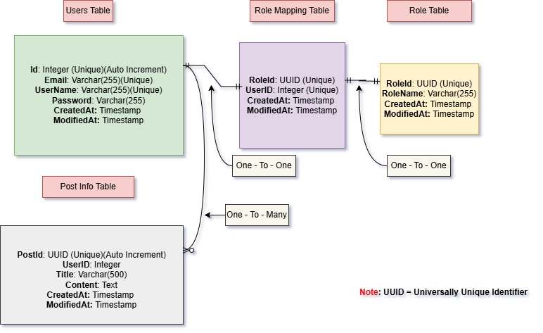

# 🚀 Social Context API (FastAPI)

## 📖 Overview

Social Context API is a **FastAPI**-based application that provides **user authentication**, **role management**, and **post creation** features. It supports **JWT authentication** and **role-based access control (RBAC)** to secure endpoints.

## 📦 Features
✅ **User Authentication (JWT)**  
✅ **Role-Based Access Control (Admin/User)**  
✅ **CRUD Operations for Users, Roles, and Posts**  
✅ **Swagger UI Documentation**  
✅ **Token-Based Authorization**  

---

📌 Prerequisites
Before using this project, ensure you have:

Python 3.10+ installed 
FastAPI & Dependencies installed 
PostgreSQL for database support 
Postman or In-built Swagger API testing 

## ⚡ Installation Guide

### 1️⃣ Clone the Repository

git clone https://github.com/Niteesh57/SocialContext.git 
cd Path

### 2️⃣ Create a Virtual Environment

python -m venv env 
.\env\Scripts\Activate  (On Windows)(My Python Version 3.11)

### 3️⃣ Install Dependencies

pip install -r requirements.txt

### 4️⃣ Set Up Environment Variables (.env File)

POSTGRESQL_DATABASE_URL = "postgresql+psycopg2://postgres:(UserName)@(Password)/(DataBase)"

SECRET_KEY = (SECRET_KEY) "09d25e094faa6ca2556c818166b7a9563b93f7099f6f0f4caa6cf63b88e8d3e7" (My Config) 
ALGORITHM = (ALGORITHM) "HS256" (My Config) 
ACCESS_TOKEN_EXPIRE_MINUTES = (ACCESS_TOKEN_EXPIRE_MINUTES) 30 (My Config) 

###  5️⃣ DB schema

5️⃣ Run Database Migrations

Run --- Python src/Models/dbConnection.py (Make Sure You Uncomment Models)

6️⃣ Start the FastAPI Server

Run --- Python run.py

7️⃣ Access API Documentation

Swagger UI: http://127.0.0.1:8000/docs 
ReDoc: http://127.0.0.1:8000/redoc

🔐 Authentication & Role-Based Access

1️⃣ User Login (/users/login)

  Authentication: JWT (Bearer Token) 
  Token Type: Bearer

# 📌 API Documentation

## 1️⃣ User Authentication

<table>
    <thead>
        <tr>
            <th>Method</th>
            <th>Endpoint</th>
            <th>Description</th>
            <th>Access</th>
        </tr>
    </thead>
    <tbody>
        <tr>
            <td>GET</td>
            <td><code>/usersAll</code></td>
            <td>Get all users</td>
            <td>Admin</td>
        </tr>
        <tr>
            <td>POST</td>
            <td><code>/users/login</code></td>
            <td>Authenticate user & get JWT</td>
            <td>Public</td>
        </tr>
        <tr>
            <td>POST</td>
            <td><code>/users/</code></td>
            <td>Create a new user</td>
            <td>Admin</td>
        </tr>
        <tr>
            <td>PUT</td>
            <td><code>/users/{user_id}</code></td>
            <td>Update user details</td>
            <td>Admin</td>
        </tr>
        <tr>
            <td>DELETE</td>
            <td><code>/users/{user_id}</code></td>
            <td>Delete user & role mappings</td>
            <td>Admin</td>
        </tr>
        <tr>
            <td>GET</td>
            <td><code>/usersById/{id}</code></td>
            <td>Get user by ID</td>
            <td>Admin</td>
        </tr>
    </tbody>
</table>

# 📌 Role Management API (Admin Only)

## 2️⃣ Role Management Endpoints

<table>
    <thead>
        <tr>
            <th>Method</th>
            <th>Endpoint</th>
            <th>Description</th>
            <th>Access</th>
        </tr>
    </thead>
    <tbody>
        <tr>
            <td>GET</td>
            <td><code>/rolesAll</code></td>
            <td>Get all roles</td>
            <td>Admin</td>
        </tr>
        <tr>
            <td>POST</td>
            <td><code>/roles/</code></td>
            <td>Create a new role</td>
            <td>Admin</td>
        </tr>
        <tr>
            <td>GET</td>
            <td><code>/usersByRole/{role_name}</code></td>
            <td>Get users by role name</td>
            <td>Admin</td>
        </tr>
        <tr>
            <td>DELETE</td>
            <td><code>/roles/{role_id}</code></td>
            <td>Delete role and associated users/posts</td>
            <td>Admin</td>
        </tr>
    </tbody>
</table>

# 📌 Role Mapping API (Admin Only)

## 3️⃣ Role Mapping Endpoints

<table>
    <thead>
        <tr>
            <th>Method</th>
            <th>Endpoint</th>
            <th>Description</th>
            <th>Access</th>
        </tr>
    </thead>
    <tbody>
        <tr>
            <td>GET</td>
            <td><code>/rolesMapAll</code></td>
            <td>Get all role mappings</td>
            <td>Admin</td>
        </tr>
        <tr>
            <td>POST</td>
            <td><code>/role-mappings</code></td>
            <td>Create a new role mapping</td>
            <td>Admin</td>
        </tr>
    </tbody>
</table>

# 📌 Post Management API

## 4️⃣ Post Management Endpoints

<table>
    <thead>
        <tr>
            <th>Method</th>
            <th>Endpoint</th>
            <th>Description</th>
            <th>Access</th>
        </tr>
    </thead>
    <tbody>
        <tr>
            <td>GET</td>
            <td><code>/postsAll</code></td>
            <td>Get all posts</td>
            <td>Authenticated Users</td>
        </tr>
        <tr>
            <td>GET</td>
            <td><code>/posts/{userId}/user</code></td>
            <td>Get posts by user ID</td>
            <td>Admin</td>
        </tr>
        <tr>
            <td>POST</td>
            <td><code>/post-create</code></td>
            <td>Create a new post</td>
            <td>Admin</td>
        </tr>
        <tr>
            <td>GET</td>
            <td><code>/{post_id}</code></td>
            <td>Get post by ID</td>
            <td>Admin</td>
        </tr>
        <tr>
            <td>PUT</td>
            <td><code>/{post_id}</code></td>
            <td>Update post details</td>
            <td>Admin</td>
        </tr>
        <tr>
            <td>DELETE</td>
            <td><code>/{post_id}</code></td>
            <td>Delete post</td>
            <td>Admin</td>
        </tr>
    </tbody>
</table>

📁 Folder Structure

src/ 
│── app/ 
│   │── main.py              # Main entry point 
│   │── routes/ 
│   │   │── users.py         # User-related endpoints 
│   │   │── roles.py         # Role management 
│   │   │── roleMap.py         # RoleMapping management 
│   │   │── posts.py         # Post management 
│   │── security/ 
│   │   │── auth.py          # Authentication & role checking 
│   │   │── hash.py          # Password hashing 
│   │   │── jwt.py           # JWT token functions 
│   │── models/ 
│   │   │── dbConnection.py  # Database connection 
│   │   │── user.py          # User model 
│   │   │── role.py          # Role model 
│   │   │── roleMapping.py   # RoleMapping model 
│   │   │── post.py          # Post model 
│   │── Validation/ 
│   │
│── requirements.txt         # Dependencies 
│── README.md                # Documentation 
│── .env                     # Environment variables 
|run.py                      # Run point (Python run.py) 

👨‍💻 Author 
B V Nagi Reddy 
nagireddybv5@gmail.com 
